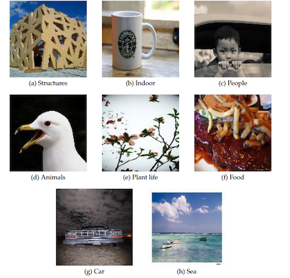
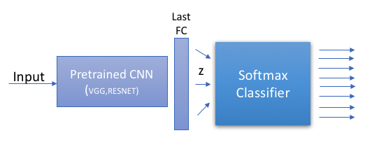

## Introduction
A couple of weeks ago, I participated in an Image Classification competition on Kaggle.  The goal of the competition was to classify thousands of images in 8 different categories.  Here, I will describe how to develop a very easy model that can be coded in less than an hour and can achieve high accuracy in image classification tasks. 

We will achieve that by using a pretrained state-of-the-art Deep Neural Network and a sigmoid classifier trained on top of the CNN codes.  

It is worth to mention that the architecture describe here can be easily applied to different problems involving different training sets. This means that you can use this very simple “framework/code” as starting point if you ever face a similar task. This idea can be found on the literature as Transfer Learning.

## The problem

The original problem statement assumed that you had been hired by a large social media website and they had given you the task to sort millions of images uploaded by their users into different categories depending on the subject of the photo.

The given dataset was composed from seven thousand (128x128 RGB) images from the FLICKR-image-tagging-dataset. Each image had a label, with the labels being {1-structures, 2-indoor, 3-
people, 4-animals, 5-plant life, 6-food, 7-car, 8-sea}. These images were shuffled
and pre-cropped randomly from the original dataset. 

{: .center-image }

In a nutshell, this is typical classification task that is faced on industry problems. 
We are given a small dataset of labeled images, and we have to build a model that generalized well to unseen examples. 

## Brainstorming Ideas

Now that we understood what we have to do. We should start considering several ways to tackle the problem. 
CNNs are the state-of-the-art architecture for image classification tasks. Therefore, it is reasonable to think in a simple CNN to solve this classification problem. However, there are two major problems if we want to train a deep CNN from scratch that generalizes well: 

1. We need a lot of computational resources.
2. We need a lot of data.

If you remember, we were only given seven thousand label images. This is clearly a very small number of training examples to train a deep model from scratch. In addition to this, we want to be able to train a powerful, but easy-to-train model able to run in a modern PC.
Therefore, the idea of training a CNN from scratch is not the way to go.

<!-- > Note: It can be easily proved that training a very simple CNN from scratch on this small dataset (128x128 RGB images) will over-fit. The same happens if we train from scratch a state-of-the-art architecture (ResNet, GoogLeNet, VGG). 
{:.note-size} -->
In practice, very few people train an entire CNN from scratch, because it is rare to have a dataset of sufficient size. Also, training very deep nets require lot of computation resources. It is therefore a common practice to pick up a pre-trained CNN model which was trained on a very large dataset. For instance, one trained on ImageNet, which contains 1.2 million images with 1000 categories. This model can then be used either as an initialization or as a fixed feature extractor for the task of interest. 

Since the given dataset is relatively small, it is not a good idea to fine-tune the whole CNN due to overfitting concerns, and therefore the best idea is to train a linear classifier on the features extracted from the CNN.

# The solution

As described before, the best and simple idea is to use a trained deep network as a feature extractor. We can then train a simple linear softmax classifier on top of the extracted features (sometimes call CNNCodes). The next figure illustrates the architecture that we are going to use. 

{: .center-image }

This architecture can be described as follow:

1. An input image is passed through a Deep CNN and the output of the last fully connected layer is obtained.
2. This latent vector (z) is then passed through a linear classifier which outputs the 
P(class \| z).

It is also important to highlight that we are dividing the task in two subproblems. This is the reason why I introduceed a latent vector (z) in the figure. This latent vector (z) are the extracted features which will be store either in memory or in a file in our computer. 

> Note that, the outputs of any state-of-the-art network such as ResNet can also be seen as P(class\|image). The difference here is that we have different classes and a different number of classes

There is one question tough, which pretrained network should we use?

In order to obtain good results, we should use a deep net trained on a very large and general dataset. There are several choices which are widely available such as ResNet, GoogLeNet, VGG, etc. 

In this case, I used the [Torch Facebook Implementation of ResNet](https://github.com/facebook/fb.resnet.torch). 

There are several reasons why choosing ResNet:

1. ResNet is a very well-known architecture that achieved state-of-the-art results in the ImageNet competition.	
2. fb.resnet.torch is a very well tested implementation made by Facebook.
3. The pretrained models for different ResNet are available (ResNet50,150,200) in this implementation.ss

In a next post, I will explain how to implement the described model in Torch7 and I will show how we can get a very accurate image classifier with just a few lines of code. 

