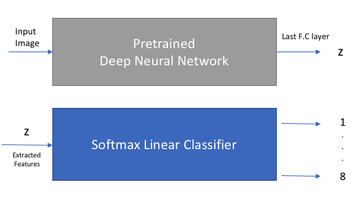
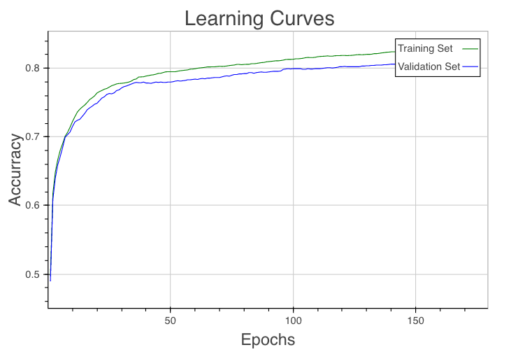

## Introduction
In my [previous post]({{site.url}}/TransferLearning/) I described a model that can be easily use if we want to build a simple, yet powerful image classifier.

Here, I will describe how to implement that model in Torch 7. I will therefore assume that you have previous experience with the Lua Programming language. If not, I advice you to [read this link](http://tylerneylon.com/a/learn-lua/) before continuing.

From the [previous post]({{site.url}}/TransferLearning/) you probably remember that we divided the classification task in two subproblems as ilustrated in the next figure.

{: .center-image }

Therefore, we will firstly focus on extracting the features.
Secondly, we will implement a sigmoid classifier.
And finally, we will put all together.

## Implementation

### 1. Extracting the features

As I said before, I will use the [ResNet implementation made by Facebook in Torch](https://github.com/facebook/fb.resnet.torch).

I therefore assume that you have already install Torch and its dependencies in your computer and that you are using a Unix based OS. 

A good tutorial on how to set up Torch for OS X/Ubuntu can be found [here](http://torch.ch/docs/getting-started.html).

Let's start downloading the fb resnet implementation and the pretrained weights for RestNet-50.

```shell
$ git clone https://github.com/facebook/fb.resnet.torch.git
$ cd fb.resnet.torch 
$ wget https://d2j0dndfm35trm.cloudfront.net/resnet-50.t7
$ cd ..
```

We can now easily extract the features by running the extract-features script that comes with the implementation.

```shell
$ th fb.resnet.torch/pretrained/extract-features.lua fb.resnet.torch/resnet-50.t7 1 ../data/train/
```

where ```/data/train/``` is the path where the given images are located. At this point we will extract the features of the seven thousand given images.

After a while, we will have a file called ```features.t7``` which contains a Torch tensor with the output of the last fully connected layer of ResNet-50. In our example the Torch tensor has dimensions 7000x2048. 

In other words, we have converted a 7000x(128x128) input tensor to a 7000x2048 one.

> Note: we are using the fb.resnet.torch implementation as a black box. This means, we can adapt this step to use any pretrained net that we want.

### 2. Training the linear classifier on top of the extracted features.

Now that we have the extracted features (z), we have to implement the linear classifier and perform the training.

Since this task is really simple (we only have to train a linear classifier), we can use any machine learning framework that we want. Since we are getting the features from a Torch implementation, I will describe how to do it in Torch. However, feel free to reach me if you need help implementing this in Tensorflow or Theano.

#### Implementing the sigmoid classifier on the extracted features - Torch

Let's start preprocessing the data. 

```lua
csvfile= "data/train.csv" --- this is the csv with the label data. Example | id | Label
csv= csvigo.load(csvfile)

---loading the extracted features

z = torch.load('features.t7').features:double()
dataDim=z:size(2)

---loading the groundtruth label
t= torch.Tensor(csv.Label)
nclasses=t:max()
```

Here, we parsed the CSV file with the label data and loaded the Torch tensor with the extracted features. 

Let's now split the data into a validation and training set, so that we can know how well the classifier is generalizing.

```lua
--Shuffling the whole given dataset before dividing it in training and val sets
torch.manualSeed(42) 
shuffle= torch.randperm(z:size(1)) 

--Creating the datasets objects for the validation and training sets

validationset={}
-- we are going to use 30 % of the whole dataset as the validation set
function validationset:size()  return 0.3 * z:size(1) end 
for i=1, validationset:size() do
    validationset[i]={z[shuffle[i]],t[shuffle[i]]}
end

trainigset={}
function trainigset:size()  return z:size(1) - validationset:size() end
for i=1, trainigset:size() do
    trainigset[i]={z[shuffle[ validationset:size()+ i]],t[shuffle[ validationset:size()+i]]}
end
```

It is important to highlight that  in order to use the implemented ```StochasticGradient``` module in Torch. The training set has to be a dataset object which implements the operator dataset[index] and implements the method dataset:size(). [You can find here the complete explanation.](https://github.com/torch/nn/blob/master/doc/training.md#nn.StochasticGradient)

Now that our data has been preprocessed, we can define the model and the loss function.

```lua
--- Defining the  model
model = nn.Sequential()
model:add(nn.Linear(dataDim,nclasses))
model:add(nn.LogSoftMax())

--Defining the loss function
criterion = nn.ClassNLLCriterion()

```

The next step is to define a trainer. In this very simple example, we are going to define ```StochasticGradient```.

```lua
trainer = nn.StochasticGradient(model, criterion)
trainer.learningRate = 0.01
trainer.maxIteration = 100 -- 100 epochs of training.
trainer:train(trainigset)
```

After executing this code, you will have a similiar output to this:

```shell
# StochasticGradient: training	
# current error = 1.4979565866764	
# current error = 1.0399591005761	
# current error = 0.80159175030653	
# current error = 0.65374676486038	
# current error = 0.53423796625859	
# current error = 0.4507387198663	
# current error = 0.39688863061617
```

From this output, we can realize that our classifier is actually learning as we can see how the cross entropy loss is decreasing. However, we cannot certainly say whether it is overfitting or not. Most importantly, we cannot estimate the level of accuracy of the classifier in the validation set.

Therefore let's start by defining an evaluation function. We can also use this function to do inference later on.

```lua
--Defining the evaluation function
function eval(model,dataset,validation)
   local correct=-1
   local r={}
   for i=1, dataset:size() do
    local example=dataset[i]
    local prediction= model:forward(example[1]) --this output the prob (class \| image)
    local confidences, indices = torch.sort(prediction, true) -- let's sort the prob
    r[i]=indices[1] -- Picking up the class with highest confidence
    if validation then --If this is the validation set we can estimate the accuracy
      if r[i]==example[2] then
        correct=correct+1
      end
    end
  end
  return r,correct
end
```


Now that we defined our ```eval``` function, we have to come out with a way to evaluate the classifier in the validation set while training. By doing this, we can also determine the best hyperparameters and decide when to stop training.

It turns out that we can easily do this by defining a callback function executed by the ```trainer.train``` method after each epoch.

```lua
local function evaluation_callback(trainer,iteration, currentError)
  _, correct=eval(trainer.module,trainigset,true)
  training_acc= correct / trainigset:size()
  print("# test accuracy = " .. training_acc)
  
  _, correct=eval(trainer.module,validationset,true)
  acc = correct / validationset:size()
  print("# validation accuracy = " .. acc)
  if trainer.stats then
    trainer.stats.tr[iteration]=training_acc
    trainer.stats.val[iteration]=acc
  end
end
```
Let's now update the trainer object so that it uses the callback and we can get the accuracy of the validation and training sets respectively while training.

```lua
trainer = nn.StochasticGradient(model, criterion)
trainer.hookIteration=evaluation_callback
trainer.stats={tr={},val={}} --we will use this table to save the stats
trainer.learningRate = 0.00001
trainer.maxIteration = 150 -- 150 epochs of training.
trainer.verbose=false -- we will print the stats in the callback
trainer:train(trainigset)
```

After executing, we will get something similar to this:

```shell
# StochasticGradient: training
# .....	
# training accuracy = 0.82448979591837	
# validation accuracy = 0.76571428571429	
# current error = 1.4979565866764	
# training accuracy = 0.84428571428571	
# validation accuracy = 0.76952380952381
# .....	
```

Now, we are able to detemine the accuracy of the validation and training set during training. We can therefore determine the best learning rate and decide when to stop.

The next step is to save the model, so that we cannot have to retrain it everytime we want to do inference in unseen examples.

```lua
--Saving the model
torch:save("model.t7", model)
```

#### Plooting the learning curves
While the verbose log can help, I consider that it is better to plot the stats in a graph, so let's do that. 

```lua
---Ploting the data
Plot = require 'itorch.Plot'
x=torch.range(1,trainer.maxIteration)

plot = Plot()
plot:line(x, torch.Tensor(trainer.stats.tr),'green','Training Set')
plot:line(x, torch.Tensor(trainer.stats.val),'blue','Validation Set')
plot:legend(true)
plot:title('Learning Curves')
plot:xaxis('Epochs'):yaxis('Accurracy')
plot:draw()
plot:save('./out.html')
```
Remeber that, in our callback function we saved the ```stats``` inside the trainer. Now, we are getting the data from it.

The next figure shows the plot I got after training the classifier for 150 epochs with a learning rate of 0.00001

{: .center-image }

From the graph above, we can determine a couple of things:

1. The classifier is generalizing well. We are getting about 82% accuracy in the validation set.
2. Increasing the number of epoch seems to be a good idea. The classifier it is not completely overfitting yet. We can see that the accuracy of the validation set is still increasing.

I encourage you to play a little bit with the learning rate and  and the number of epoch since it may help to get a slightly better performance.

### Putting all the training together

The simpler and easier way to put all the training together is to use a bash script, let's call it ```train_model.sh```

```bash
images_path = $1
th fb.resnet.torch/pretrained/extract-features.lua fb.resnet.torch/resnet-50.t7 1 $images_path
th train.lua

```
where train.lua is our trainer.


That's all!!!, after a while we will have our trained model.

### Evaluating the model

Now, that we had our model implemented and the weights saved in the file ```model.t7```, we have to implement the script that will classify the images and will output the prediction in a CSV file.

You probably remember that we already defined an evaluation model function that we use to estimate the accuracy of the classifier in the validation and training sets. We can therefore reload the saved trained model and reuse that function to evaluate the data. 

```lua
require 'nn'
require 'csvigo' ---luarocks install csvigo
require 'torch'
require 'evaluate'


model = torch.load('model.t7')
z = torch.load('features_prediction.t7').features

dataset={}
function dataset:size()  return z:size(1)  end
for i=1, dataset:size() do
    dataset[i]={z[i]:double()}
end

pred,_ = eval(model,dataset,false)

output={}
for i=1,#pred do
  output[i]={id=i,Label=pred[i]}
end

csvigo.save('test.csv',output,true)
```

This script works as follow:

1. It loads our trained model 
2. It loads the extracted features of the unseen images (they can be extracted in the same way we extracted the features of the training data) 
3. It uses the evaluation function we defined before and does the prediction.
4. it saves the prediction in a csv file

If we want, we can put all together in another bash we can call ```predict.sh```

```bash
images_path=$1
th fb.resnet.torch/pretrained/extract-features.lua fb.resnet.torch/resnet-50.t7 1 $images_path
mv features.t7 features_prediction.t7
th prediction.lua
```
That's all!!!!!

We have our powerful image classifier with just a few lines of code.

Note that, since we use the fb.resnet.torch implementation as a black-box, you can easily change the Deep CNN to whatever you like.
This is the reason why we loaded the extracted features from an external file.

